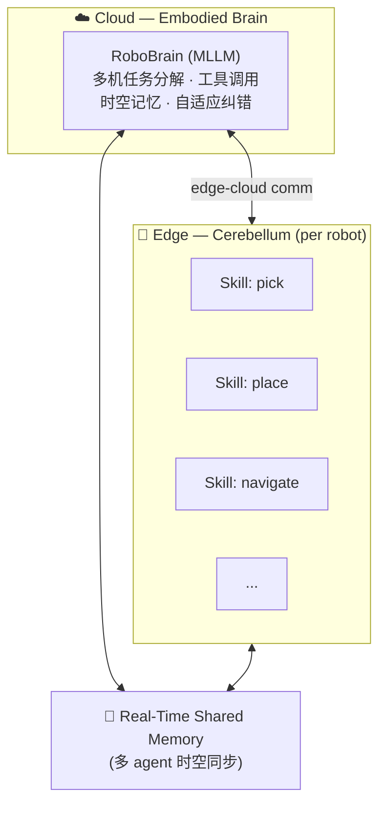
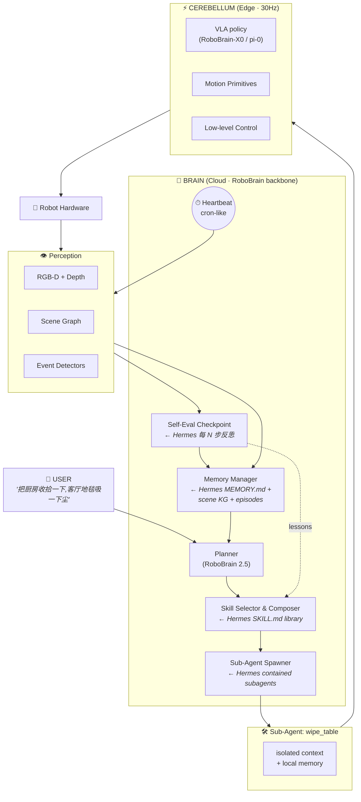

# RoboHousekeeper-Agent: 基于 Hermes 框架借鉴的家务机器人 Agent 调研

## RoboOS 

## Roadmap

### 整体架构

### 模块对应表

| 模块 | 灵感来源 | 实现路径 |
|------|---------|---------|
| `brain/planner` | RoboBrain 2.5 | 调用本地 / API 推理 |
| `brain/skill_library` | **Hermes Skills** | YAML+Markdown,带 trigger / preconditions / failure modes |
| `brain/self_eval` | **Hermes Self-Improving Loop** | 每 N 步 checkpoint,生成 trajectory summary |
| `brain/memory` | **Hermes Memory** + scene graph | `MEMORY.md` (家庭事实) + `SCENE.json` (动态场景图) + `EPISODES.db` (历史轨迹) |
| `brain/orchestrator` | **Hermes Sub-Agent + Kanban** | 任务分解为 kanban-style cards,失败重试 / 升级机制 |
| `perception` | Scene Graph-Guided Replanning | 事件驱动 + 周期性扫描混合 |
| `executor` | RoboOS Cerebellum | 接 RoboBrain-X0 / OpenVLA / pi-0 等 VLA 模型 |
| `executor/rollout.py` | **hermes-embodied `collect_trajectories.py`** | MuJoCo / RoboCasa rollout,LeRobot 格式存储 |
| `training/finetune_smolvla.py` | **hermes-embodied `train_smolvla.py`** | SmolVLA 微调封装(本地 GPU) |
| `scripts/offline_improve.py` | **hermes-embodied `improvement_loop.py`** | A/B checkpoint 比较 + 自动晋升 |
| `safety_guard` | **Hermes Soul** + 物理约束 | hard limits + 软约束(用户偏好) |
